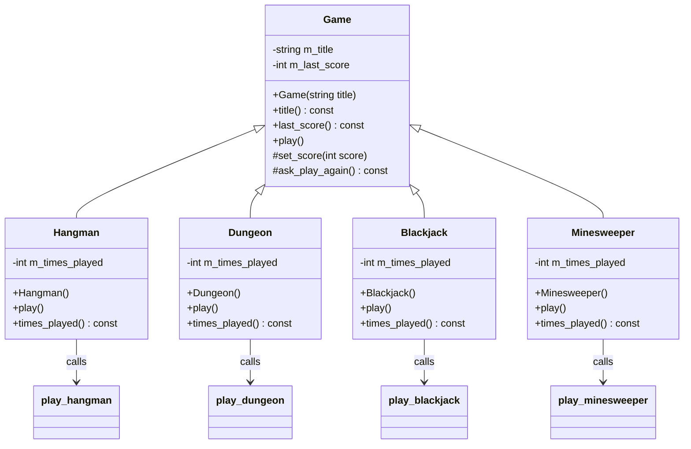

# Lab 12 - Class Diagram

```mermaid
classDiagram
    Game <|-- Hangman
    Game <|-- Dungeon
    Game <|-- Blackjack
    Game <|-- Minesweeper

    class Game {
        -string m_title
        -int m_last_score
        +Game(string title)
        +title() const
        +last_score() const
        +play()
        #set_score(int score)
        #ask_play_again() const
    }

    class Hangman {
        -int m_times_played
        +Hangman()
        +play()
        +times_played() const
    }

    class Dungeon {
        -int m_times_played
        +Dungeon()
        +play()
        +times_played() const
    }

    class Blackjack {
        -int m_times_played
        +Blackjack()
        +play()
        +times_played() const
    }

    class Minesweeper {
        -int m_times_played
        +Minesweeper()
        +play()
        +times_played() const
    }

    Hangman --> play_hangman : calls
    Dungeon --> play_dungeon : calls
    Blackjack --> play_blackjack : calls
    Minesweeper --> play_minesweeper : calls
```

